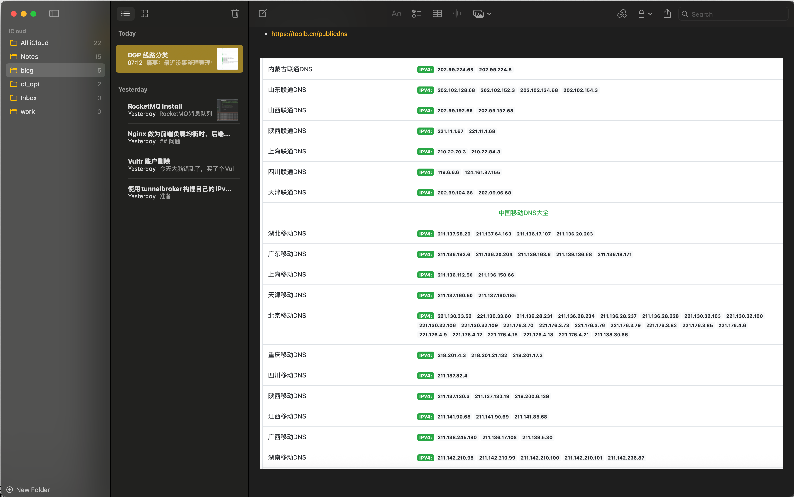
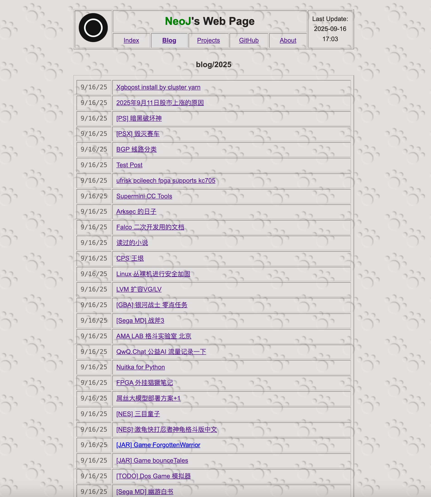
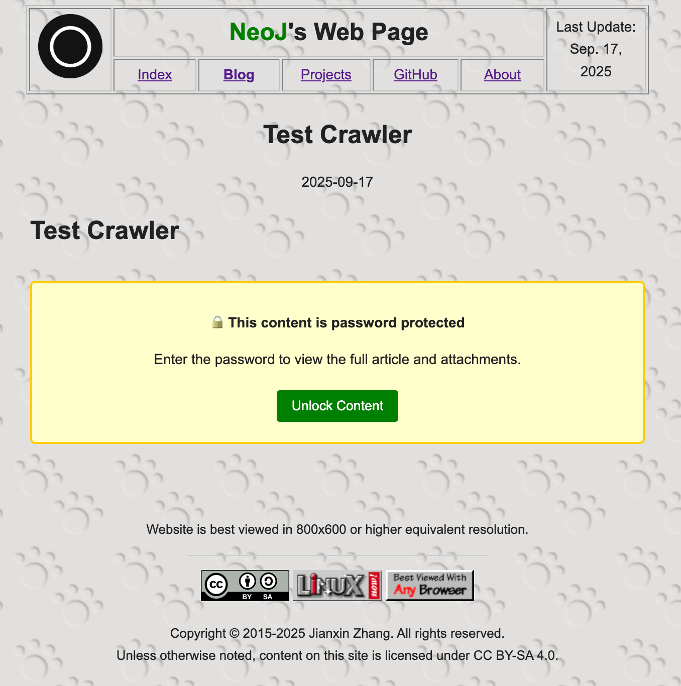
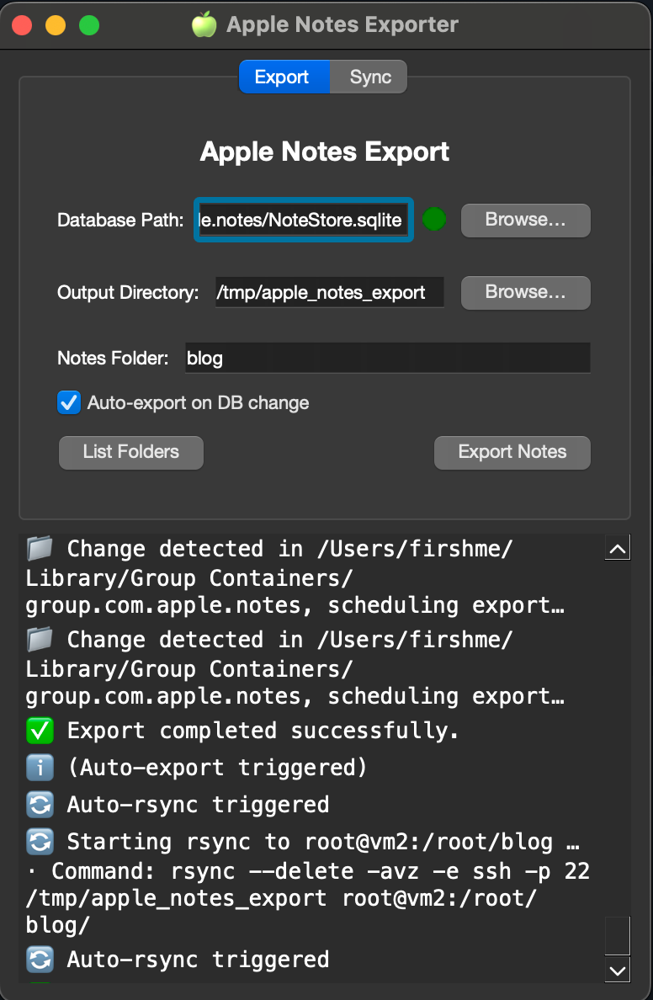

## simples

* Sync Mac Notes to web page
* 根据自己的MacOS版本选择符合自己的分支即可。

> 注意：如果你使用的是MacOS 26.0及以上版本，请使用`release/macos_26.x`分支。如果你使用的是MacOS 15.x及以下版本，请使用`release/macos_15.x`分支。




* index page



* password protected



* PyQt6 GUI


 
#### 简单干净

* https://firsh.me


#### quick start

* install python3 and deps

* install golang 1.25.0 or later

* web page server

```bash
#x86
make build 
# or
go build .
```

* Start Gui Config

```bash
python watch_notes_service_v2/qt_main.py
```

* open `http://localhost:8080`


#### 感谢

* https://github.com/keithvassallomt/taskbridge
* https://www.ciofecaforensics.com/2024/12/10/ios18-notes/
* https://github.com/threeplanetssoftware/apple_cloud_notes_parser
