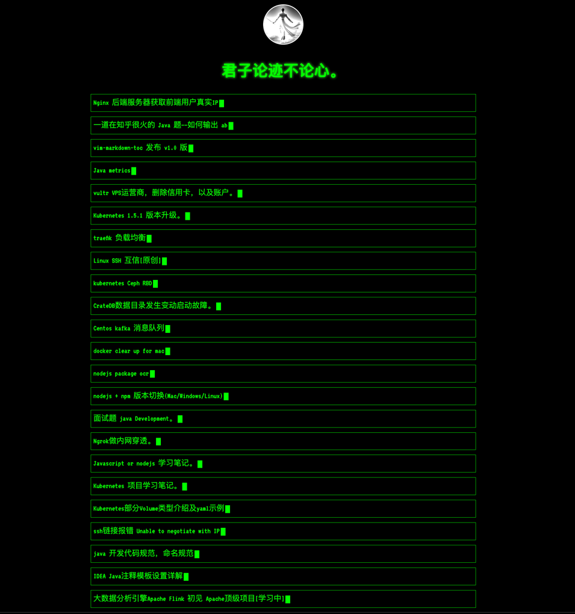
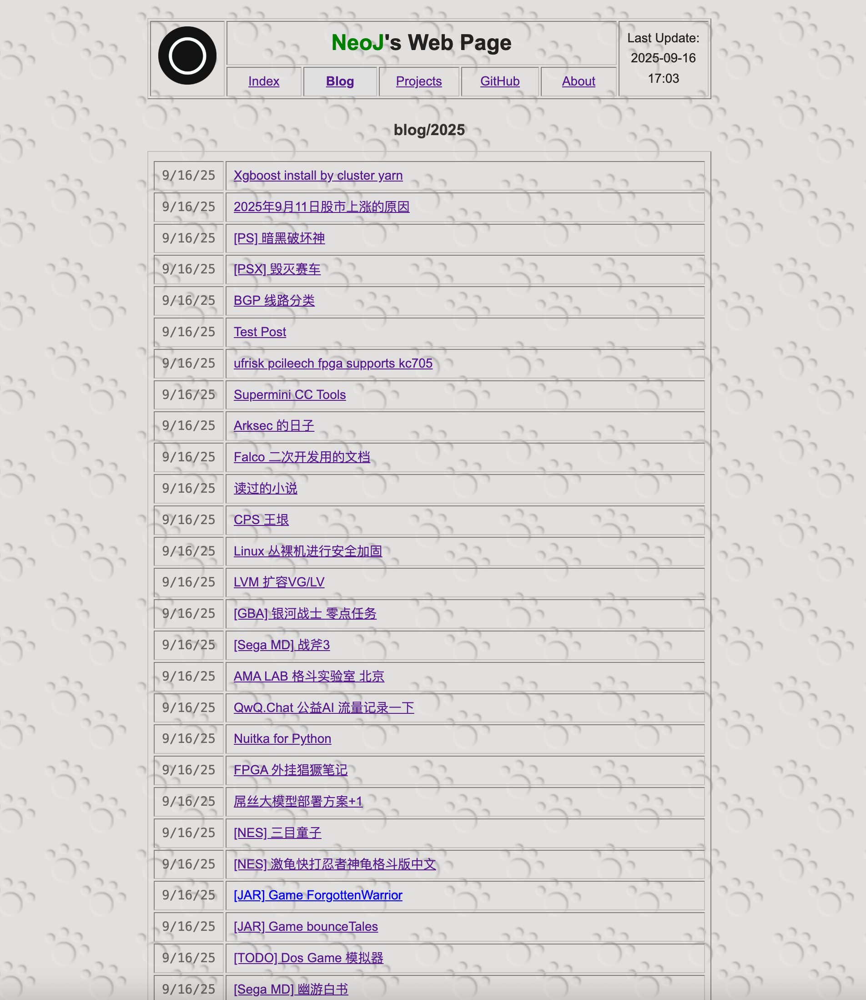
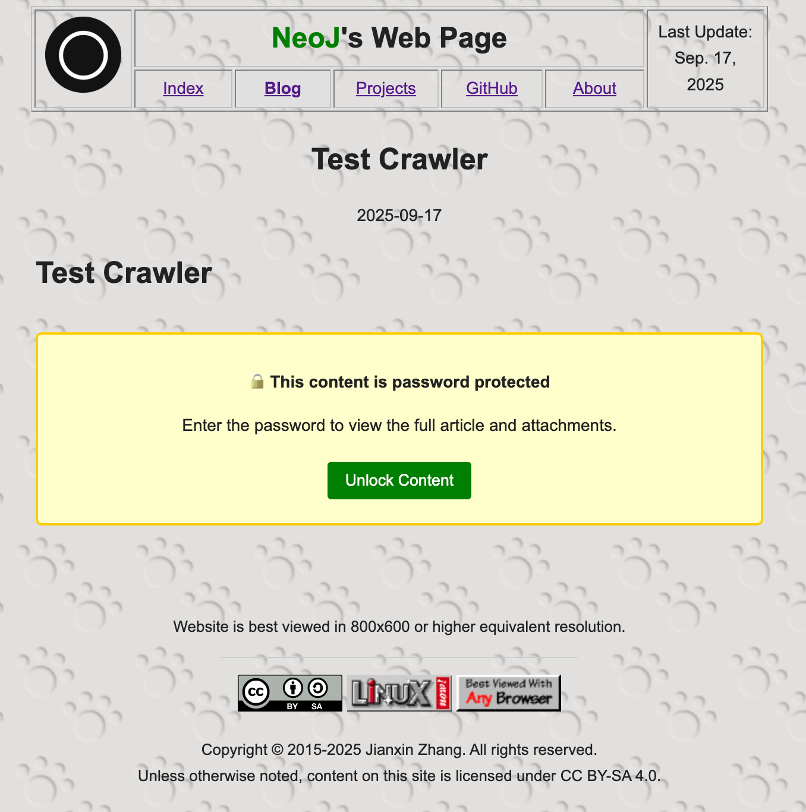
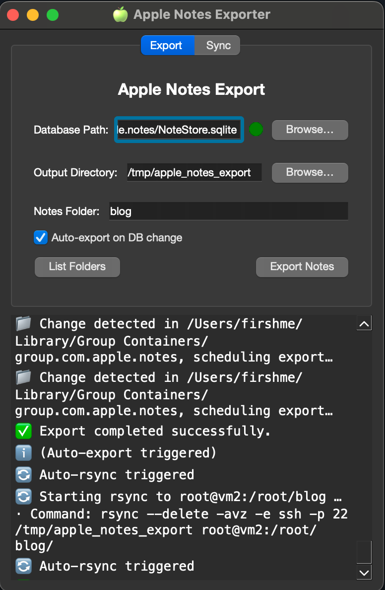

## simples

* Sync Mac Notes to web page




* index page



* password protected



* PyQt6 GUI


 
#### 简单干净

* https://firsh.me


#### quick start

* install python3 and deps

* install golang 1.25.0 or later

* web page server

```bash
#x86
make build 
# or
go build .
```

* Start Gui Config

```bash
python watch_notes_service_v2/qt_main.py
```

* open `http://localhost:8080`


#### 感谢

* https://github.com/keithvassallomt/taskbridge
* https://www.ciofecaforensics.com/2024/12/10/ios18-notes/
* https://github.com/threeplanetssoftware/apple_cloud_notes_parser


### build package 

```bash
python -m pip install -U pip setuptools wheel
python -m pip install PySide6 nuitka ordered-set zstandard
❯ python -m nuitka --version
2.7.13
Commercial: None
Python: 3.13.7 | packaged by Anaconda, Inc. | (main, Sep  9 2025, 19:54:17) [Clang 17.0.6 ]
Flavor: Anaconda Python
GIL: yes
Executable: ~/miniconda/envs/zlibs/bin/python
OS: Darwin
Arch: arm64
macOSRelease: 15.5
Version C compiler: /opt/homebrew/opt/llvm/bin/clang (clang 20.1.7).
```

* Nuitka