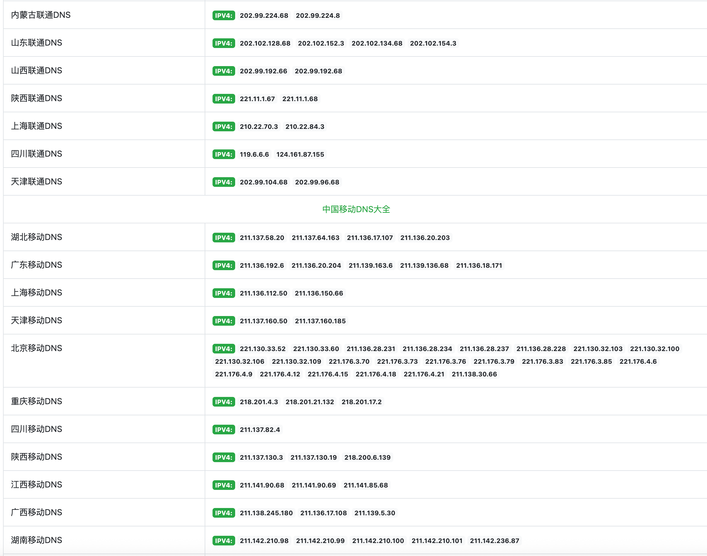

# BGP 线路分类  
  
摘要：最近没事整理整理书签、顺便记下笔记。  
  
    
  
* cn2 gia  
* cn2 gt  
* 163  
* AS9929  
* AS4837  
* CUVIP  
* 线路选择  
* 回程判断方法  
  
**## cn2 gia**  
  
**电信专有**cn2 gia 特点：国内、国外全部走59.43节点，如果所在的地方没有 59.43 节点就只能走 202.97 节点了，速度快，**价格贵**。cn2 gia 出国和回国都有自己单独的通道。    
**简单来说** **cn2 gia** **王者**  
  
**## cn2 gt**  
  
**电信专有**cn2 gt 特点：国外走 59.43 节点，国内走 202.97（AS4134）节点。cn2 gt 出国有自己单独的通道，回国和163走一个通道，而回国线路比出国线路重要，163回国线路很拥挤，所以cn2 gt一般般。    
**cn2 gt** **应该可以和** **CUVIP** **不分上下。**  
  
**## 163**  
  
**电信专有**163 特点：国内全部走202.97（AS4134）节点，电信骨干网，承担了中国电信90%的业务负载（即163骨干网有电信整个海外出口的90%带宽容量），简单来说就是普通家用的。    
**163** **线路一般情况下晚高峰卡爆。**  
  
**## AS9929**  
  
**联通专有**AS9929 特点：线路经过218.105.\*.\*/210.51.\*.\*（AS9929），主要是因为用的人很少，所以负载低，速度快，**价格贵**。    
**AS9929** **对标** **cn2 gia**  
  
**## AS4837**  
  
**联通专有**AS4837 特点：这玩意就是联通普通家用。    
**AS4837** **对标****电信****163**  
  
**## CUVIP**  
  
**联通专有**CUVIP，即**走圣何塞出口的****AS4837**，因为带宽很便宜，而且容量大，负载很小（基本都跑到洛杉矶去了），所以表现很好。AS4837 本来对标163，但是因为**走圣何塞出口的****AS4837**的速度快就单独称为CUVIP了。  
  
**## 线路选择**  
  
自己家宽带联通基本可以随意选，优选AS4837或者AS9929，**服务器带宽占决定性因素，带宽口子越大越好**。    
自己家宽带电信，能选cn2 gia就选cn2 gia吧，不能选就老老实实根据服务器商提供的测速链接测速然后购买。  
  
**## 回程判断方法**  
  
回程测试需要登录 VPS，然后输入下面命令安装 BestTrace：  
  
```bash  
  
wget https://cdn.ipip.net/17mon/besttrace4linux.zip  
  
unzip besttrace4linux.zip  
  
chmod +x besttrace  
  
```  
  
之后，执行下面命令开始测试：  
  
```  
  
./besttrace 218.2.2.2  
  
```  
  
#### 测试地址可以使用当地的 dns  
  
    
  
* https://toolb.cn/publicdns  
  
